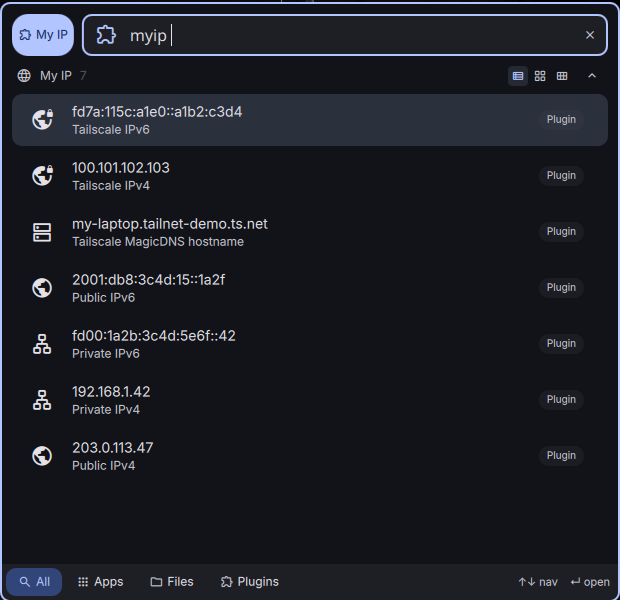

# My IP

A [DankMaterialShell](https://github.com/AvengeMedia/DankMaterialShell) (DMS) launcher plugin to quickly view and copy your IP addresses. It shows your private, public, and Tailscale IPs (both IPv4 and IPv6) along with your Tailscale MagicDNS hostname. Press Enter on any entry to copy it to your clipboard.



## Features

- Private IPv4 and IPv6 (your local network address)
- Public IPv4 and IPv6 (your internet-facing address)
- Tailscale IPv4 and IPv6 (shown only when Tailscale is installed and running)
- Tailscale MagicDNS hostname
- Type after the trigger to filter results (for example `myip 192.`)
- Press Enter on any item to copy it to the clipboard

## Requirements

- **DankMaterialShell 1.4.0 or newer**
- **curl** (used to look up your public IP)
- **tailscale** (optional). Tailscale entries appear only if the `tailscale` command is available and the backend is running. Everything else works without it.

Private IP detection uses `hostname -I` / `ip`, which are present on standard Linux systems.

## Installation

### From the official DMS plugin repository

> Note: this plugin has not been submitted to the official registry yet. Once it is accepted, install it with either method below.

- Open DMS settings, go to **Plugins**, browse the registry, find **My IP**, and click install, or
- Install from the command line:

  ```sh
  dms plugins install myip
  ```

  You can browse the registry with `dms plugins browse` and see what is installed with `dms plugins list`.

### Manual installation

DMS loads plugins from `~/.config/DankMaterialShell/plugins/`. Place this plugin in its own folder there.

1. Clone or copy the plugin into the plugins directory:

   ```sh
   git clone https://github.com/dwright134/dms-myip.git ~/.config/DankMaterialShell/plugins/myIP
   ```

   Or, if you already have the files, copy the folder so it lands at `~/.config/DankMaterialShell/plugins/myIP`.

2. Restart DMS so it picks up the new plugin:

   ```sh
   dms restart
   ```

3. Enable **My IP** in DMS settings under **Plugins** if it is not already active.

The folder must contain `plugin.json`, `qmldir`, and the `.qml` files.

## Usage

1. Open the launcher (Super+Space, or click the launcher button).
2. Type your trigger (`myip` by default) to list your IPs.
3. Optionally keep typing to filter (for example `myip 10.` or `myip tail`).
4. Press Enter on an item to copy it to your clipboard.

## Customizing the trigger phrase

The trigger is the word you type in the launcher to activate the plugin. It defaults to `myip`.

To change it, open DMS settings, go to **Plugins**, select **My IP**, and set the **Trigger** field to whatever you prefer (for example `ip` or `whatismyip`). The change is saved immediately, and the new phrase activates the plugin the next time you open the launcher.

If you prefer editing files directly, you can also set the default in `plugin.json` before first launch:

```json
"trigger": "ip"
```

The value saved in settings takes precedence over the one in `plugin.json`.

## License

Released under the [MIT License](LICENSE).
